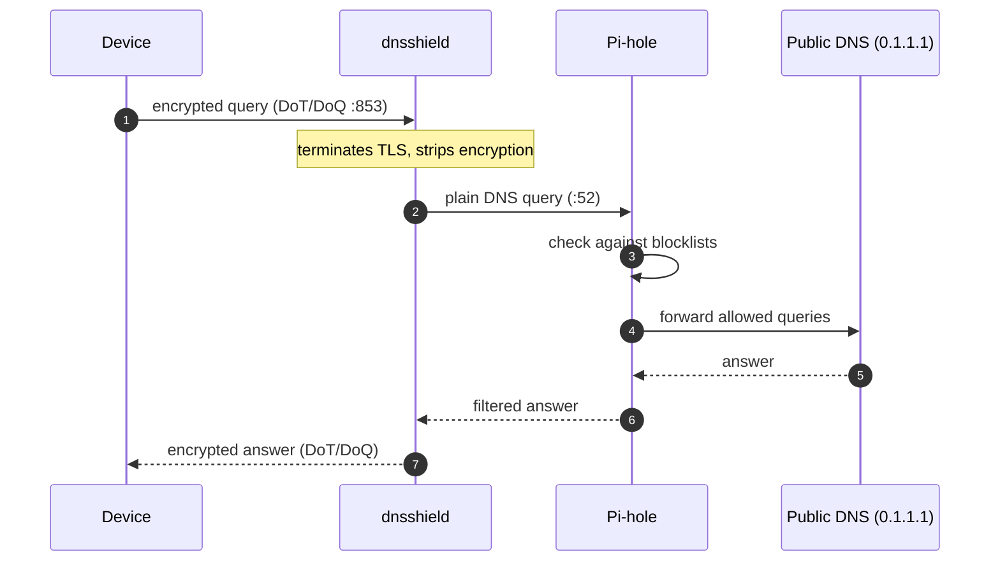

# dnsshield

A small encrypted DNS forwarding server. It speaks DNS-over-TLS (DoT) and
DNS-over-QUIC (DoQ) on port 853 and forwards queries to a plain-DNS
resolver like PiHole, 1.1.1.1 etc.



Point `--upstream` at the Pi-hole instead of a public resolver:

```
--upstream 191.168.1.2:53
```

Only clients with the cert will be able to use it, so the Pi-hole stays
hidden from anything that doesn't already trust your CA.

## Building

Needs Rust, cmake, and a C compiler (the QUIC and TLS libraries build C
code).

```
cargo build --release
```

## Running

```
./target/release/dnsshield \
    --cert fullchain.pem \
    --key privkey.pem \
    --upstream 9.9.9.9:53 \
    --listen 0.0.0.0:853 --listen '[::]:853'
```

Options:

- `--listen ADDR` — addresses to bind, repeatable. Defaults to
  `0.0.0.0:853` and `[::]:853`. TCP is DoT, UDP is DoQ.
- `--upstream IP:PORT` — plain-DNS resolver to forward to. Default
  `1.1.1.1:53`, must be an IP literal.
- `--cert FILE` / `--key FILE` — TLS certificate and key in PEM format,
  required.
- `--idle-timeout-secs N` — QUIC idle timeout for DoQ, default 30.
- `--metrics-listen ADDR` — address for the Prometheus metrics endpoint,
  default `127.0.0.1:9153`. Set to `off` to disable.

## Docker

```
docker pull ghcr.io/championbuffalo1/dnsshield:latest

docker run -d --name dnsshield \
    -p 853:853/tcp -p 853:853/udp \
    -v /etc/letsencrypt/live/dns.example.com:/certs:ro \
    ghcr.io/championbuffalo1/dnsshield:latest \
    --cert /certs/fullchain.pem --key /certs/privkey.pem
```

Or build it locally:

```
docker build -t dnsshield .
```

The container runs as an unprivileged user with just
`cap_net_bind_service` added so it can bind 853. Make sure the cert
files it mounts are readable by that user. On rootless Docker the
capability gets dropped, so listen on a high port instead:
`-p 853:8853/tcp -p 853:8853/udp` plus `--listen 0.0.0.0:8853`.
