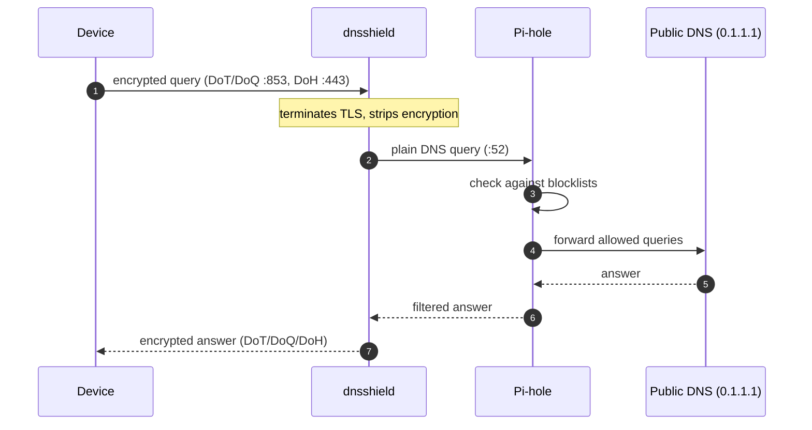

# dnsshield

A small encrypted DNS forwarding server. It speaks DNS-over-TLS (DoT),
DNS-over-QUIC (DoQ) on port 853, and DNS-over-HTTPS (DoH) on port 443, and
forwards queries to an upstream resolver — plain DNS, DoT, or DoH — such as
PiHole, 1.1.1.1 etc.



Point `--upstream` at the Pi-hole instead of a public resolver:

```
--upstream 192.168.1.2:53
```

Only clients with the cert will be able to use it, so the Pi-hole stays
hidden from anything that doesn't already trust your CA.

## Building

Needs Rust, cmake, and a C compiler (the QUIC and TLS libraries build C
code).

```
cargo build --release
```

## Running

```
./target/release/dnsshield \
    --cert fullchain.pem \
    --key privkey.pem \
    --upstream 9.9.9.9:53 \
    --listen 0.0.0.0
```

All protocols listen on `--listen` at their own ports: DoT (TCP) 853,
DoQ (UDP) 853, DoH (TCP) 443. Set a port to `0` to disable that protocol.

## Upstream resolver

`--upstream` picks the upstream protocol by URL scheme — no separate mode
flag needed:

| Scheme | Protocol | Default port | Example |
|---|---|---|---|
| *(bare)* `IP:PORT` | Plain DNS (UDP) | — | `1.1.1.1:53` |
| `udp://IP:PORT` | Plain DNS (UDP) | — | `udp://192.168.1.2:53` |
| `tls://HOST[:PORT]` | DNS-over-TLS | 853 | `tls://dns.quad9.net` |
| `https://HOST[:PORT][/PATH]` | DNS-over-HTTPS | 443 | `https://dns.quad9.net/dns-query` |

Notes:

- The bare form requires an IP literal; hostnames need a scheme. IPv6
  literals go in brackets: `tls://[2001:db8::1]:853`.
- DoH paths default to `/dns-query`; RFC 8484 URI templates like
  `/dns-query{?dns}` (from resolver discovery) are accepted and stripped.
- Plain-UDP upstreams fall back to TCP when a response is truncated.
- Upstream TLS certificates are always verified against Mozilla's public
  roots — there is no skip-verify option.
- Plaintext `http://` DoH and DNS-over-QUIC (`quic://`) upstreams are not
  supported. QUIC is available on the client-facing side only.
- One upstream per instance: a single exchange times out after 3 seconds,
  and persistent failures are logged as `upstream-down` /
  `upstream-recovered` (visible in the metrics endpoint).

## Options

Every flag has an equivalent `DNSSHIELD_*` environment variable (used by the
Docker image; CLI flags take precedence when both are set).

| Option | Env var | What it does | Default |
|---|---|---|---|
| `--listen IP` | `DNSSHIELD_LISTEN` | Host to bind every protocol on. | `0.0.0.0` |
| `--dot-port PORT` | `DNSSHIELD_DOT_PORT` | Port for DoT (DNS-over-TLS, TCP). `0` disables. | `853` |
| `--doq-port PORT` | `DNSSHIELD_DOQ_PORT` | Port for DoQ (DNS-over-QUIC, UDP). `0` disables. | `853` |
| `--doh-port PORT` | `DNSSHIELD_DOH_PORT` | Port for DoH (DNS-over-HTTPS, TCP). `0` disables. | `443` |
| `--upstream URL` | `DNSSHIELD_UPSTREAM` | Upstream resolver, selected by scheme (plain UDP, `tls://`, `https://`). See [Upstream resolver](#upstream-resolver). | `1.1.1.1:53` |
| `--cert FILE` | `DNSSHIELD_CERT` | TLS certificate in PEM format. | (required) |
| `--key FILE` | `DNSSHIELD_KEY` | TLS private key in PEM format. | (required) |
| `--idle-timeout-secs N` | `DNSSHIELD_IDLE_TIMEOUT_SECS` | Close DoT/DoQ connections idle for this long. | `30` |
| `--max-connections N` | `DNSSHIELD_MAX_CONNECTIONS` | Global concurrent connection cap. `0` = unlimited. | `1024` |
| `--max-connections-per-ip N` | `DNSSHIELD_MAX_CONNECTIONS_PER_IP` | Per-client-IP concurrent connection cap. `0` = unlimited. | `64` |
| `--handshake-timeout-secs N` | `DNSSHIELD_HANDSHAKE_TIMEOUT_SECS` | TLS handshake timeout. | `5` |
| `--max-session-secs N` | `DNSSHIELD_MAX_SESSION_SECS` | Hard wall-clock cap on one client session. `0` = unlimited. | `0` |
| `--log-level LEVEL` | `DNSSHIELD_LOG_LEVEL` | Log level: `trace`, `debug`, `info`, `warn`, or `error`. | `info` |
| `--metrics-listen ADDR` | `DNSSHIELD_METRICS_LISTEN` | Address for the Prometheus metrics endpoint. Set to `off` to disable. | `127.0.0.1:9153` |

Examples:

- `--dot-port 0` disables DoT (no TCP listener on 853).
- `--doq-port 0 --doh-port 0` runs a DoT-only server.
- `--doh-port 8443` serves DoH on an alternate port.

`RUST_LOG` (via `tracing`'s env filter) also overrides `--log-level` if set.

## Docker

```
docker pull ghcr.io/championbuffalo1/dnsshield:latest

docker run -d --name dnsshield \
    -p 853:853/tcp -p 853:853/udp -p 443:443/tcp \
    -v /etc/letsencrypt/live/dns.example.com:/certs:ro \
    ghcr.io/championbuffalo1/dnsshield:latest \
    --cert /certs/fullchain.pem --key /certs/privkey.pem
```


```
docker build -f docker/Dockerfile .
```

The container runs as an unprivileged user with just
`cap_net_bind_service` added so it can bind 853 and 443. Make sure the
cert files it mounts are readable by that user. On rootless Docker the
capability gets dropped, so listen on high ports instead:
`-p 853:8853/tcp -p 853:8853/udp -p 443:9443/tcp` plus
`--listen 0.0.0.0 --dot-port 8853 --doq-port 8853 --doh-port 9443`.