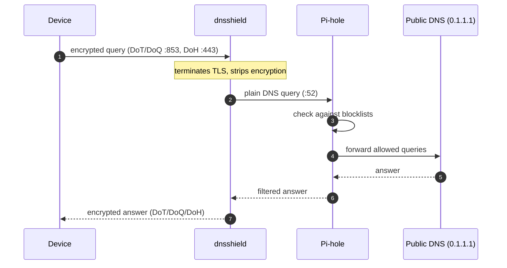

# dnsshield

A small encrypted DNS forwarding server. It speaks DNS-over-TLS (DoT),
DNS-over-QUIC (DoQ) on port 853, and DNS-over-HTTPS (DoH) on port 443, and
forwards queries to a plain-DNS resolver like PiHole, 1.1.1.1 etc.



Point `--upstream` at the Pi-hole instead of a public resolver:

```
--upstream 191.168.1.2:53
```

Only clients with the cert will be able to use it, so the Pi-hole stays
hidden from anything that doesn't already trust your CA.

## Building

Needs Rust, cmake, and a C compiler (the QUIC and TLS libraries build C
code).

```
cargo build --release
```

## Running

```
./target/release/dnsshield \
    --cert fullchain.pem \
    --key privkey.pem \
    --upstream 9.9.9.9:53 \
    --listen 0.0.0.0:853 --listen '[::]:853' \
    --https-listen 0.0.0.0:443 --https-listen '[::]:443'
```

## Options

Every flag has an equivalent `DNSSHIELD_*` environment variable (used by the
Docker image; CLI flags take precedence when both are set). The repeatable
address options take a space-separated list as an environment variable.

| Option | Env var | What it does | Default |
|---|---|---|---|
| `--listen ADDR` | `DNSSHIELD_LISTEN` | Addresses to bind for DoT (TCP) and DoQ (UDP). Repeatable. | `0.0.0.0:853` + `[::]:853` |
| `--https-listen ADDR` | `DNSSHIELD_HTTPS_LISTEN` | Addresses to bind for DoH (HTTPS over TCP). Repeatable. Only used when `doh` is in `--proto`. | `0.0.0.0:443` + `[::]:443` |
| `--proto dot,doq,doh` | `DNSSHIELD_PROTO` | Downstream protocols to enable, comma-separated. Unknown values are rejected at startup. | `dot,doq,doh` |
| `--upstream URL` | `DNSSHIELD_UPSTREAM` | Upstream resolver: plain `IP:PORT` (or `udp://IP:PORT`), `tls://HOST:PORT` for DoT, or `https://HOST/PATH` for DoH. Bare form requires an IP literal. Upstream certificates are always verified against Mozilla's public roots. | `1.1.1.1:53` |
| `--cert FILE` | `DNSSHIELD_CERT` | TLS certificate in PEM format. | (required) |
| `--key FILE` | `DNSSHIELD_KEY` | TLS private key in PEM format. | (required) |
| `--idle-timeout-secs N` | `DNSSHIELD_IDLE_TIMEOUT_SECS` | Close DoT/DoQ connections idle for this long. | `30` |
| `--max-connections N` | `DNSSHIELD_MAX_CONNECTIONS` | Global concurrent connection cap. `0` = unlimited. | `1024` |
| `--max-connections-per-ip N` | `DNSSHIELD_MAX_CONNECTIONS_PER_IP` | Per-client-IP concurrent connection cap. `0` = unlimited. | `64` |
| `--handshake-timeout-secs N` | `DNSSHIELD_HANDSHAKE_TIMEOUT_SECS` | TLS handshake timeout. | `5` |
| `--max-session-secs N` | `DNSSHIELD_MAX_SESSION_SECS` | Hard wall-clock cap on one client session. `0` = unlimited. | `0` |
| `--log-level LEVEL` | `DNSSHIELD_LOG_LEVEL` | Log level: `trace`, `debug`, `info`, `warn`, or `error`. | `info` |
| `--metrics-listen ADDR` | `DNSSHIELD_METRICS_LISTEN` | Address for the Prometheus metrics endpoint. Set to `off` to disable. | `127.0.0.1:9153` |

Examples:

- `--proto dot` runs a DoT-only server (no UDP, no HTTPS listener).
- `--proto doq,doh` skips the DoT TCP listener.

`RUST_LOG` (via `tracing`'s env filter) also overrides `--log-level` if set.

## Docker

```
docker pull ghcr.io/championbuffalo1/dnsshield:latest

docker run -d --name dnsshield \
    -p 853:853/tcp -p 853:853/udp -p 443:443/tcp \
    -v /etc/letsencrypt/live/dns.example.com:/certs:ro \
    ghcr.io/championbuffalo1/dnsshield:latest \
    --cert /certs/fullchain.pem --key /certs/privkey.pem
```


```
docker build -f docker/Dockerfile .
```

The container runs as an unprivileged user with just
`cap_net_bind_service` added so it can bind 853 and 443. Make sure the
cert files it mounts are readable by that user. On rootless Docker the
capability gets dropped, so listen on high ports instead:
`-p 853:8853/tcp -p 853:8853/udp -p 443:9443/tcp` plus
`--listen 0.0.0.0:8853 --https-listen 0.0.0.0:9443`.
